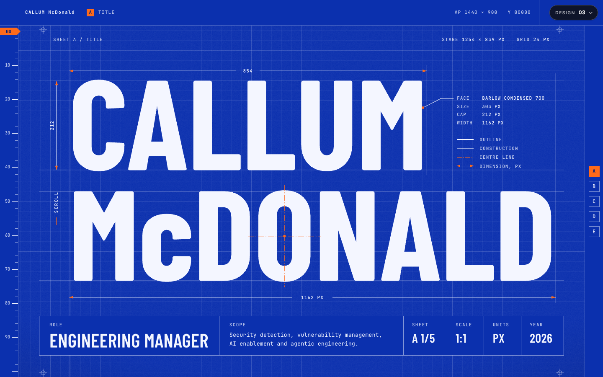
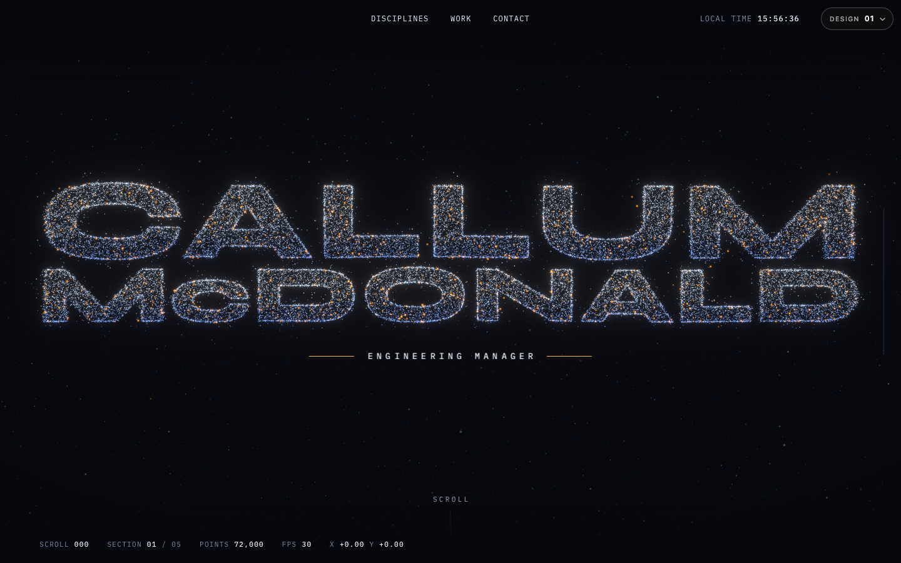
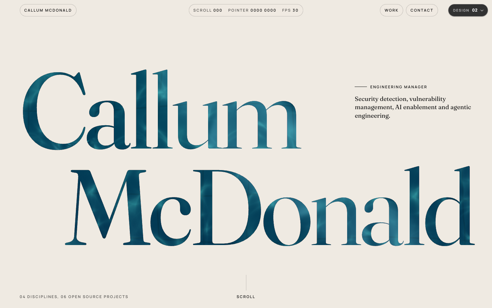
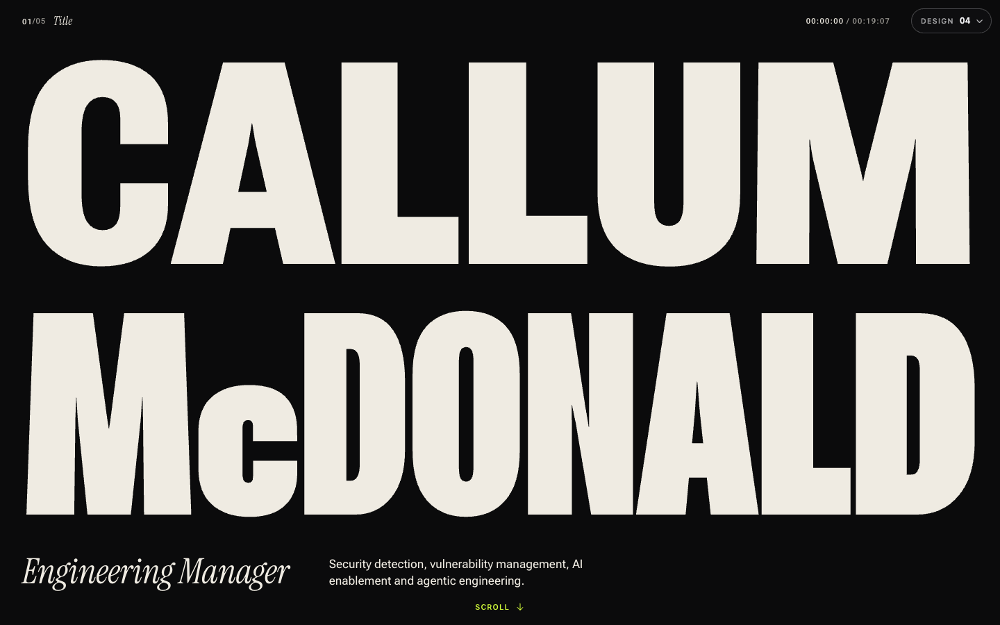

# maccydee.github.io

[](LICENSE)
[](https://github.com/maccydee/maccydee.github.io/actions/workflows/pages.yml)


Personal site for Callum McDonald, Engineering Manager, at
**https://maccydee.github.io**

Five different designs of the same page. One loads at random on every visit,
and the picker in the top right switches between them.



| | | |
|---|---|---|
|  |  |  |
| **01 Constellation.** 72,000 GPU particles form the name, then morph as you scroll. | **02 Water.** A real ripple simulation, seen through the letters. | **04 Reel.** A kinetic typography scroll film. |

**03 Blueprint** is a technical drawing that drafts itself, and **05 Gravity** is
a physics playground where everything can be grabbed and thrown.

## How it works

- `lab/` is a Vite + React + TypeScript app. Each design is a self-contained
  page under `lab/src/concepts/<name>/`.
- `lab/src/content.ts` is the single source of copy for all five designs.
- `lab/src/App.tsx` picks the design and renders the picker. Add `?c=blueprint`
  (or `constellation`, `liquid`, `reel`, `gravity`) to link to one design.
- `.github/workflows/pages.yml` builds `lab/` and publishes it to GitHub Pages
  on every push to `main`.
- `concepts/` holds earlier single-file designs, including the previous live
  page.

## Run it locally

```bash
cd lab
npm install
npm run dev
```

## Licence

MIT, see [LICENSE](LICENSE).
